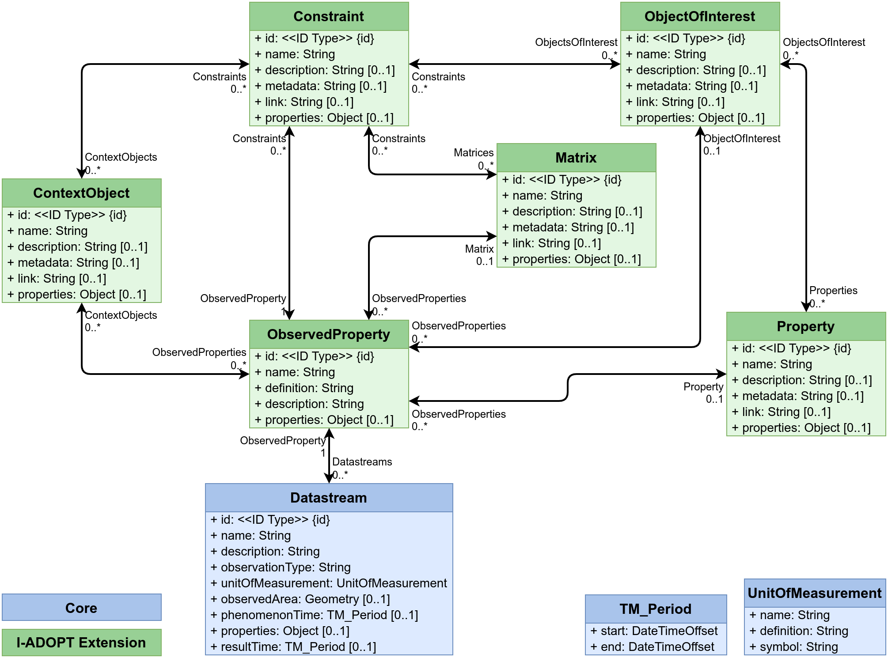

# FROST-Server.Plugin.ObservableProperty

A FROST-Server plugin implementing a prototype ObservableProperties model

## Settings

* **plugins.observableproperty.enable:**  
  Toggle indicating the Actuation plugin should be enabled. Default: `false`.
* **plugins.observableproperty.idType.Constraint:**  
  The type of the primary key column of the Constraint table. Defaults to the value of **plugins.coreModel.idType**.
* **plugins.observableproperty.idType.ContextObject:**  
  The type of the primary key column of the ContextObject table. Defaults to the value of **plugins.coreModel.idType**.
* **plugins.observableproperty.idType.Matrix:**  
  The type of the primary key column of the Matrix table. Defaults to the value of **plugins.coreModel.idType**.
* **plugins.observableproperty.idType.ObjectOfInterest:**  
  The type of the primary key column of the ObjectOfInterest table. Defaults to the value of **plugins.coreModel.idType**.
* **plugins.observableproperty.idType.Property:**  
  The type of the primary key column of the Property table. Defaults to the value of **plugins.coreModel.idType**.

